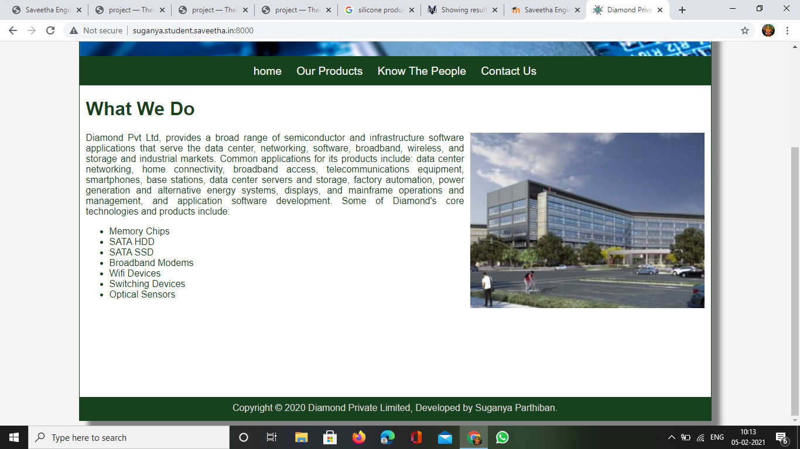
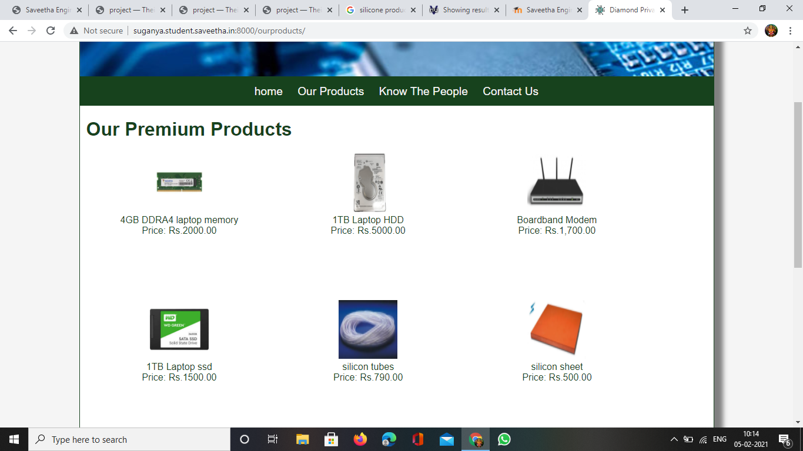
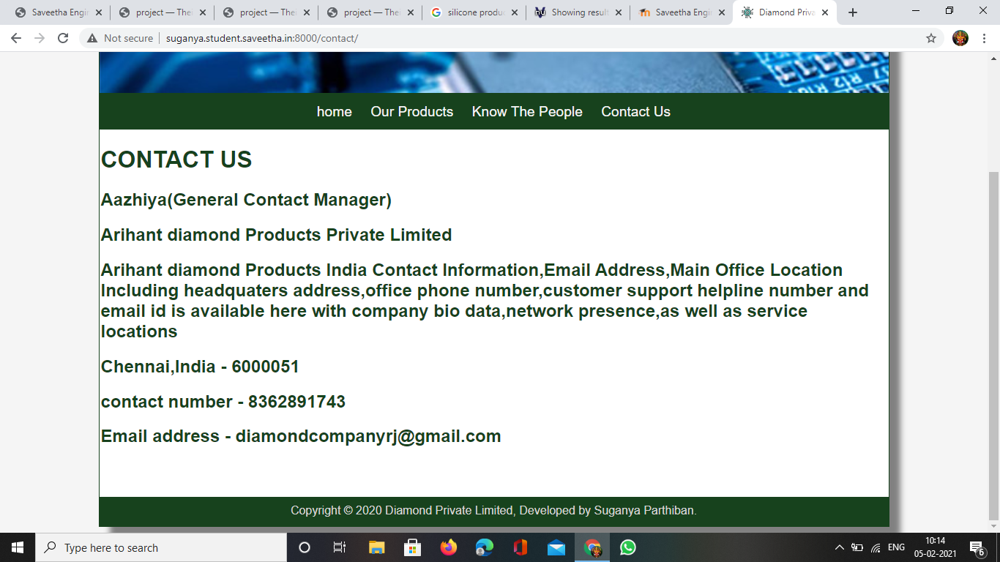
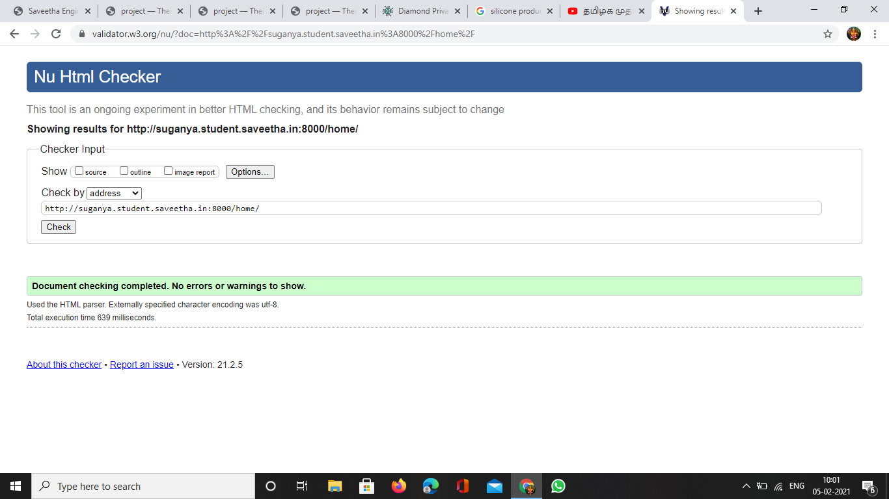
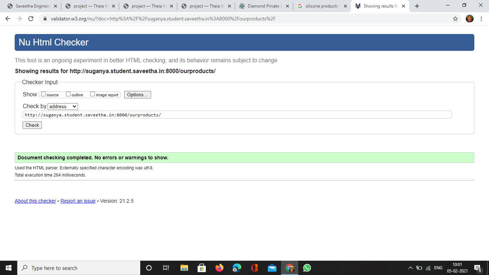
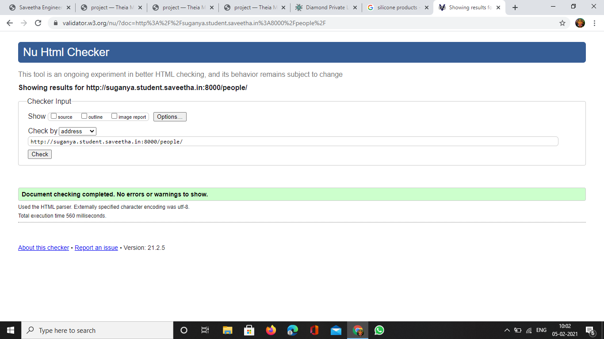

# Web Design for a Manufacturing Company
## AIM: 
To design a static website for a chip manufacturing company.

## DESIGN STEPS:
### Step 1: 
Requirement collection.
### Step 2:
Creating the layout using HTML and CSS.
### Step 3:
Updating the sample content.
### Step 4:
Choose the appropriate style and color scheme.
### Step 5:
Validate the layout in various browsers.
### Step 6:
Validate the HTML code.
### Step 6:
Publish the website in the given URL.

## PROGRAM:

### base.html
```

<!DOCTYPE html>
<html lang="en">

<head>
    <title>Diamond Private Limited</title>
    <link rel="stylesheet" href="">
    <link rel = "icon" href ="" type = "image/x-icon"> 
              
</head>

<body>
    <div class="container">
    <div class="banner">
        Diamond Private Limited.
    </div>
    <div class="menu">
        <div class="menuitem"><a href="/home">home</a></div> 
        <div class="menuitem"><a href="/ourproducts">Our Products</a></div> 
        <div class="menuitem"><a href="/people">Know The People</a></div>
        <div class="menuitem"><a href="/contact">Contact Us</a></div> 
    </div><div class="content">
        
    
    </div>
    <div class="footer">
        Copyright © 2020 Diamond Private Limited, Developed by Suganya Parthiban.
    </div>
    </div>
</body>

</html>
```

### home.html
```



    <div class="homecontent">    
    <h1>What We Do</h1>
    
    <div class="contenttext">
    Diamond Pvt Ltd, provides a broad range of semiconductor and infrastructure software applications that serve the data center, networking, software, broadband, wireless, and storage and industrial markets. Common applications for its products include: data center networking, home connectivity, broadband access, telecommunications equipment, smartphones, base stations, data center servers and storage, factory automation, power generation and alternative energy systems, displays, and mainframe operations and management, and application software development. Some of Diamond's core technologies and products include:
    <ul>
        <li>Memory Chips</li>
        <li>SATA HDD</li>
        <li>SATA SSD </li>
        <li>Broadband Modems</li>
        <li>Wifi Devices</li>
        <li>Switching Devices</li>
        <li>Optical Sensors</li>
    </ul> 
    </div>
    </div>

```
### products.html
```



    <div class="productcontent">    
    <h1>Our Premium Products</h1>
    <div class="productitems">
        <div class="productitem"> 
            <div class="itemimage">
            
            </div>
            <div class="itemname">4GB DDRA4 laptop memory</div>
            <div class="itemprice">Price: Rs.2000.00 </div>
        </div>
        <div class="productitem"> 
            <div class="itemimage">
            
            </div>
            <div class="itemname">1TB Laptop HDD</div>
            <div class="itemprice">Price: Rs.5000.00 </div>
        </div>
        <div class="productitem"> 
            <div class="itemimage">
            
            </div>
            <div class="itemname">Boardband Modem</div>
            <div class="itemprice">Price: Rs.1,700.00 </div>
        </div>
        <div class="productitem"> 
            <div class="itemimage">
            
            </div>
            <div class="itemname">1TB Laptop ssd</div>
            <div class="itemprice">Price: Rs.1500.00 </div>
        </div>
        <div class="productitem"> 
            <div class="itemimage">
            
            </div>
            <div class="itemname">silicon tubes</div>
            <div class="itemprice">Price: Rs.790.00 </div>
        </div>
        <div class="productitem"> 
            <div class="itemimage">
            
            </div>
            <div class="itemname">silicon sheet</div>
            <div class="itemprice">Price: Rs.500.00 </div>
        </div>
        <div class="productitem"> 
            <div class="itemimage">
            
            </div><div class="itemname">watch</div>
            <div class="itemprice">Price: Rs.500.00 </div>
        </div>
        <div class="productitem"> 
            <div class="itemimage">
            
            </div><div class="itemname">silicon battry</div>
            <div class="itemprice">Price: Rs.5000.00 </div>
        </div>
        <div class="productitem"> 
            <div class="itemimage">
            
            </div><div class="itemname">switch</div>
            <div class="itemprice">Price: Rs.300.00 </div>
        </div>
        <div class="productitem"> 
            <div class="itemimage">
            
            </div><div class="itemname">silicon sparay</div>
            <div class="itemprice">Price: Rs.950.00 </div>
        </div>
         <div class="productitem"> 
            <div class="itemimage">
            
            </div><div class="itemname">micro chip</div>
            <div class="itemprice">Price: Rs.500.00 </div>
        </div>
        <div class="productitem"> 
            <div class="itemimage">
            
            </div><div class="itemname">optial lence</div>
            <div class="itemprice">Price: Rs.1500.00 </div>
        </div>
    </div>
    </div>

```

### people.html
```



 <div class="productcontent">    
    <h1>our peoples</h1>
    <div class="productitems">
        <div class="productitem"> 
            <div class="itemimage">
            
            </div>
            <div class="itemname">FORBE</div>
            <div>ceo</div>
        </div>
        <div class="productitem"> 
            <div class="itemimage">
            
            </div>
            <div class="itemname">sachin</div>
            <div>sales exclutive</div>
        </div>
        <div class="productitem"> 
            <div class="itemimage">
            
            </div>
            <div class="itemname">vishwanathan anand</div>
            <div>manager</div>
        </div>
        <div class="productitem"> 
            <div class="itemimage">
            
            </div>
            <div class="itemname">dhoni</div>
            <div>assitant manager</div>
        </div>
        <div class="productitem"> 
            <div class="itemimage">
            
            </div>
            <div class="itemname">mukeshamboney</div>
            <div>md</div>
        </div>
        <div class="productitem"> 
            <div class="itemimage">
            
            </div>
            <div class="itemname">kalanidhi</div>
            <div>production department</div>
        </div>
    </div>
    </div>


```

### contact.html
```



<div class="content">
    <h1>CONTACT US</h1>
    <div class="contacttext">
        <h2>Aazhiya(General Contact Manager)</h2>
        <h2>Arihant diamond Products Private Limited</h2>
        <h2>Arihant diamond Products India Contact Information,Email Address,Main Office Location Including
headquaters address,office phone number,customer support helpline number and email id is available here 
with company bio data,network presence,as well as service locations </h2>
        <h2>Chennai,India - 6000051</h2>
        <h2>contact number - 8362891743</h2>
        <h2>Email address - diamondcompanyrj@gmail.com</h2>
    </div>
</div>



```
## OUTPUT:







## CODE VALIDATION REPORT:





## RESULT:
Thus a website is designed for the chip manufacturing company and is hosted in the URL http://suganya.student.saveetha.in:8000/. HTML code is validated.